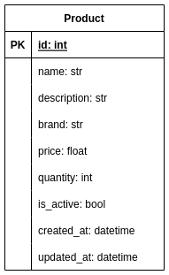

# Clean Architecture Python (ca-python)

Projeto <u>(ainda em construção)</u> implementa uma <b>API Rest</b> seguindo as estruturas e padrões da Arquitetura Limpa utilizando Python.

A ideia deste projeto é apenas para cunho didático e você que está lendo, pode clonar, forkar ou qualquer coisa do tipo.

> Irei propor uma problemática abaixo e ao longo do tempo (meu tempo livre), irei implementando seguindo as boas práticas de Clean Architecture, obviamente, como está em construção, algumas coisas podem não estar ainda de acordo com as boas práticas, mas que logo serão refatoradas.

## Contexto e problemática

Imagine em um cenário que você precise implementar uma <b>API Rest</b> para uma loja virtual, mais precisamente, uma <b>`Vitrine Online`</b>. E nessa vitrine online, o usuário pode ver os produtos, adicionar em um carrinho e fazer um checkout fictício (não irá realizar a compra de fato, apenas irá armazenar como se fosse uma venda e limpar o carrinho do cliente). Considere que para este cenário, todos os produtos obedecerão a mesma estrutura [1], apens `description` que não será um campo obrigatório. Além disso, não é apenas os consumidores que utilizarão esta api, os lojistas  também poderão cadastrar seus produtos utilizando esta api e certifique que os lojistas sejam devidamente autenticados e autorizados a interagir apenas com seus próprios produtos (remover, atualizar).

## Componentes da Arquitetura Limpa

<i>... em construção.</i>
